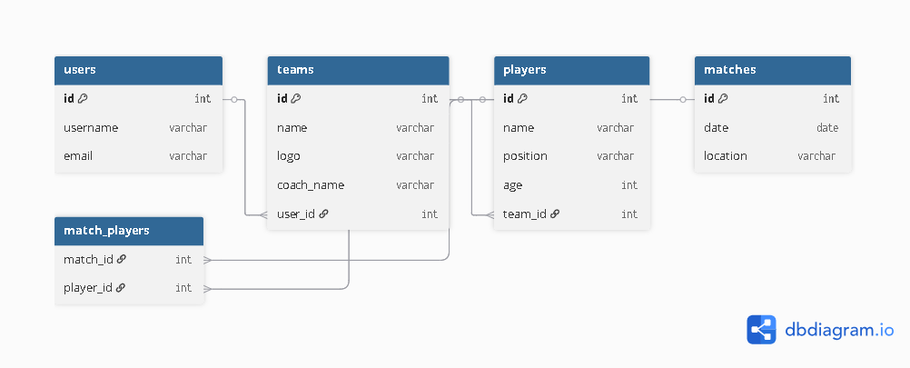

# Capstone-Project :Football Match Tracker 

Football Tracker

A Django web application to manage football teams, players, and matches. Users can create teams, add players, schedule matches, and track results. The application supports user authentication, profiles, and responsive design with dark mode.

User Stories

 1- As a registered user, I can create a new team and view my teams.

 2- As a registered user, I can add players to my teams.

 3- As a registered user, I can schedule matches between teams I own and record the results.

 4- As a registered user, I can update my profile information ( password, profile image).

 5- As a registered user, I can view teams and players and  modify only the ones i created.

 6- As a registered user, I can delete players or matches or teams that I created.

 

 #### ERD Diagram  ####

 

 ## Installation 

 1- **Clone the repository**

 git clone https://github.com/nezaralbraizat2-ui/Capstone-Project.git

 cd Capstone-Project

 2-**Create virtual environment**

 python -m venv venv

 source venv/bin/activate  # On Linux/macOS
    # For Windows, use: venv\Scripts\activate
     

 3- **Install dependencies**
 
 pip install -r requirements.txt

 4- **Database Setup**

  python manage.py migrate
    python manage.py createsuperuser # Optional, if needed for initial setup

 5- **Run the project**

  python manage.py runserver

 6- **Open in browser**

  http://127.0.0.1:8000/